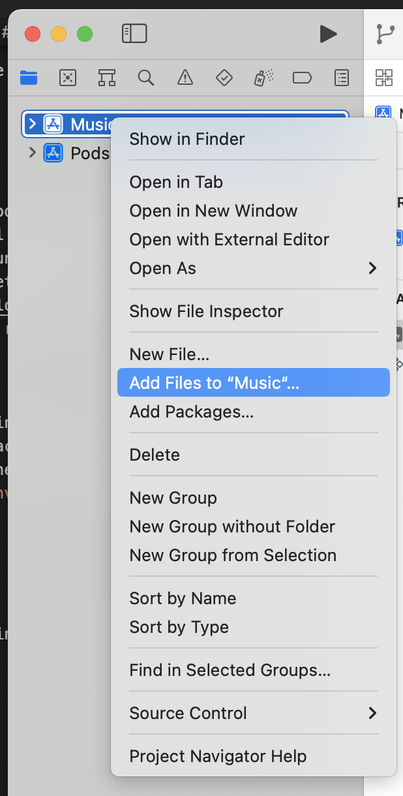
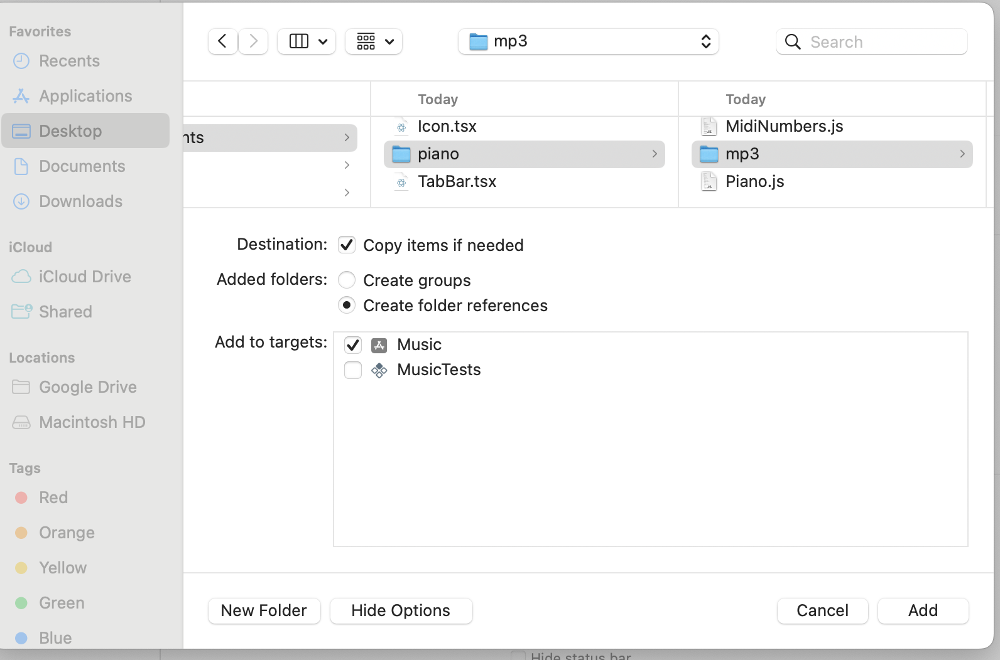

# INTRO

- Music has been an important part of human culture for centuries.
Many people enjoy listening to music and appreciate the artistry and
skill of professional musicians. However, not everyone is born with a
natural talent for creating music. For some, the idea of composing
their own music can be intimidating or seem impossible.

- Despite this, many people still have a deep love for music and a
desire to create it themselves.

- This project aims to give people a chance to create their own music. Hope you enjoy it!

# PREREQUISITE

# FOR IOS

- If you don't have CocoaPods, you can install it by running `sudo gem install cocoapods`
- Watchman: You can install Watchman using Homebrew or by downloading it from the official website. 
- VScode is preferred to run the project.
- Node version should be between 16 and 18.
https://nodejs.org/en/download Or you can use nvm to install from the command line.
- Mac laptop and Xcode are required to run it on IOS. Xcode can be downloaded from AppStore.

# INSTALLATION

0. Clone the repository using the `git clone` command
1. Install the necessary packages: `yarn install`
2. Retrieve the pods for the project: `yarn pod`
3. Create env file: `cp .env.example .env`

# Start the application

# FOR IOS

- Start the application using the command `yarn ios`

# NOTE:

- If the command `yarn ios` gives an error, try building it in Xcode.

# Potential issues

- When building the application in Xcode, if the error is "cannot find folder mp3", delete the mp3 folder under project name and try the following:

mp3 is located at src/components/piano/mp3

